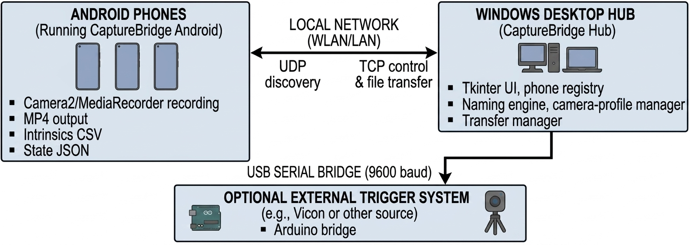
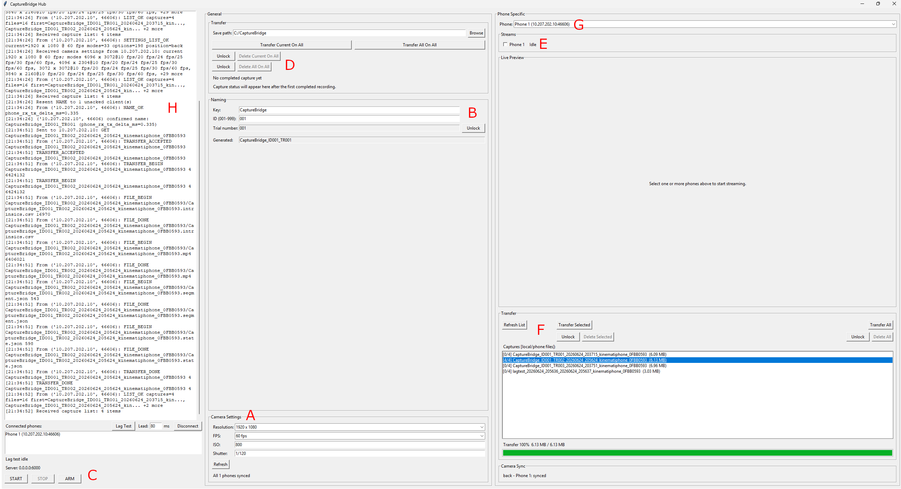

# CaptureBridge Hub

CaptureBridge is a local or USB-connected acquisition system for smartphone-based
markerless motion-analysis workflows. CaptureBridge Hub is the Windows desktop
control app: it connects to compatible iOS and Android clients over local
network or USB/ADB reverse transport, keeps capture names and camera settings
aligned, starts and stops all phones together, transfers recordings back to the
PC, and can bridge trigger events to Arduino and Vicon lab workflows.

The goal is repeatable acquisition, not a locked-in analysis algorithm. The Hub
collects organized phone videos and metadata that can be used downstream with
single-camera monocular analysis, multi-camera reconstruction, video-to-pose
workflows, mesh-based pose estimation, or OpenSim-compatible
inverse-kinematics pipelines.



_Figure 1. CaptureBridge Hub coordinates Android phones over USB or the local
network and can bridge external trigger systems through Arduino._

## Companion Android App

CaptureBridge Hub is designed to work with the CaptureBridge Android phone
client. For normal lab use, download the Android APK from the
[latest CaptureBridge Android release](https://github.com/USTP-Biomechanics/CaptureBridge-Android/releases/latest).
The phone app source lives in
[USTP-Biomechanics/CaptureBridge-Android](https://github.com/USTP-Biomechanics/CaptureBridge-Android).

Important connection note: the Hub can connect to Android phones over USB with
ADB reverse port forwarding, or over the local Wi-Fi/LAN discovery path. Wi-Fi
use usually needs the PC and phones on the same private network, Windows should
use the Private network profile, and firewall exceptions are commonly required
for TCP `6000`, UDP `6000`, and the phone streaming UDP port `6101`.

## Quick Start

For normal use, download the portable release ZIP from the
[latest GitHub release](https://github.com/USTP-Biomechanics/CaptureBridge-Hub/releases/latest),
extract it, download and install the Android APK from the
[latest CaptureBridge Android release](https://github.com/USTP-Biomechanics/CaptureBridge-Android/releases/latest),
and start the Windows app with the BAT file. That is the easiest path and does
not require Python or internet access on the lab PC.

### Recommended Portable Release

1. Download `CaptureBridge_Hub_Minimal_Offline.zip` from the
   [latest GitHub release](https://github.com/USTP-Biomechanics/CaptureBridge-Hub/releases/latest).
2. Extract the ZIP to a normal folder, for example `Documents` or `Desktop`.
3. Download the Android APK from the
   [latest CaptureBridge Android release](https://github.com/USTP-Biomechanics/CaptureBridge-Android/releases/latest)
   and copy it to the phone if needed.
4. Install the downloaded APK on the phone. If Android asks, allow installing
   this APK from the file manager or browser you are using.
5. Connect the phone over USB with USB debugging enabled, or put the PC and
   phone on the same private Wi-Fi or LAN.
6. On the PC, double-click `Run_CaptureBridge_Hub.bat` in the extracted folder.
7. Allow Windows firewall access on Private networks when prompted.
8. Start the CaptureBridge Android app on the phone.
9. Confirm the phone appears in CaptureBridge Hub.
10. Fill in the session naming fields and confirm the camera profile is synced.
11. Press `START`, then `STOP`.
12. Transfer the current capture or all captures from the hub.

The portable Hub release includes the Windows app, its Python runtime, and the
Arduino/Vicon bridge files. The Android APK is published separately in the
[latest CaptureBridge Android release](https://github.com/USTP-Biomechanics/CaptureBridge-Android/releases/latest).
No separate Python install is needed.

### Repo Run For Development

Use the BAT files. That is the intended way to run the app from a checked-out
repository.

1. Put the PC and phones on the same private network.
2. Double-click [Run_CaptureBridge_Hub.bat](Run_CaptureBridge_Hub.bat).
3. If this is the first repo run, the launcher automatically calls
   [Setup_CaptureBridge_Hub.bat](Setup_CaptureBridge_Hub.bat).
4. Allow Windows firewall access on Private networks when prompted.
5. Start the compatible iOS or Android phone clients. Android phones can
   connect over USB/ADB reverse first, then fall back to Wi-Fi discovery.
6. Confirm the phones appear in CaptureBridge Hub.

If setup reports that Python is missing, install Python 3 for Windows and run
[Run_CaptureBridge_Hub.bat](Run_CaptureBridge_Hub.bat) again.

## Interface Overview



The red labels in the screenshot mark the main operator areas:

- **A**: Global camera profile for shutter, resolution, FPS, and ISO. These
  settings are synced to the connected phones before capture. A shorter shutter
  can reduce motion blur but needs more light; higher ISO brightens the image
  but can add noise. See [Configuration](#configuration) for saved defaults.
- **B**: Capture naming fields. The generated capture name is sent to all
  phones before recording. The fields, choices, order, and output formatting can
  be changed in [app_config.json](app_config.json).
- **C**: Session controls. `START` and `STOP` control all connected phones.
  `ARM` listens for Arduino or Vicon trigger input when the bridge is connected.
  `Lag Test` measures phone start/stop timing with a fullscreen visual timing
  target, and `Disconnect` turns off phone networking when needed. If the
  phones are not in silent mode, each phone plays a tone when capture starts
  and stops. See [Lag Test](#lag-test), [Arduino Bridge](#arduino-bridge), and
  [Vicon Nexus Integration](#vicon-nexus-integration).
- **D**: Global transfer and delete actions for all phones. Transfers are saved
  to the selected folder. Delete actions must be unlocked before the delete
  buttons can be used.
- **E**: Live preview stream controls. A single phone can usually stream at
  `1920 x 1080`; for multiple simultaneous streams, reduce the stream
  resolution or max dimension. Streaming can use UDP over Wi-Fi or TCP through
  USB/ADB reverse, and it drains phone batteries faster. See
  [Phone Live Preview](#phone-live-preview).
- **F**: Captures and files stored on the phone selected in **G**.
- **G**: Phone selector for per-phone file lists, transfers, deletes, and status.
- **H**: Log output for discovery, connection, sync, transfer, stream, and
  troubleshooting messages.

## Network And Firewall

CaptureBridge Hub listens on:

- TCP `6000`: phone control, capture commands, file transfer, delete, and camera settings
- UDP `6000`: phone discovery
- UDP `6101`: raw phone live preview stream

For Android, the default transport mode is `adb_reverse_first`: the Hub watches
for authorized USB devices, sets up ADB reverse forwarding for TCP `6000` and
the preview stream port, and Android tries USB before Wi-Fi discovery. If USB is
not available, phones discover the PC automatically over UDP. If discovery or
streaming does not work, check these first:

- For USB: the phone is authorized for USB debugging and ADB is available.
- For Wi-Fi: PC and phones are on the same Wi-Fi or LAN segment.
- For Wi-Fi: Windows network profile is set to Private.
- For Wi-Fi: inbound firewall rules allow TCP `6000`, UDP `6000`, and UDP `6101`.
- VPNs, guest Wi-Fi isolation, and strict corporate networks are not blocking local traffic.

PowerShell firewall rules, run as Administrator:

```powershell
New-NetFirewallRule -DisplayName "CaptureBridge Hub UDP Discovery 6000" -Direction Inbound -Protocol UDP -LocalPort 6000 -Action Allow -Profile Private
New-NetFirewallRule -DisplayName "CaptureBridge Hub TCP Control 6000" -Direction Inbound -Protocol TCP -LocalPort 6000 -Action Allow -Profile Private
New-NetFirewallRule -DisplayName "CaptureBridge Hub Phone Stream UDP 6101" -Direction Inbound -Protocol UDP -LocalPort 6101 -Action Allow -Profile Private
```

Legacy `netsh` alternative:

```cmd
netsh advfirewall firewall add rule name="CaptureBridge Hub UDP Discovery 6000" dir=in action=allow protocol=UDP localport=6000 profile=private
netsh advfirewall firewall add rule name="CaptureBridge Hub TCP Control 6000" dir=in action=allow protocol=TCP localport=6000 profile=private
netsh advfirewall firewall add rule name="CaptureBridge Hub Phone Stream UDP 6101" dir=in action=allow protocol=UDP localport=6101 profile=private
```

## Citation

If you use CaptureBridge in academic work, please cite the shared software
citation:

```text
Simonlehner, M. (2026). CaptureBridge: Hub and Android client [Computer software suite].
https://github.com/USTP-Biomechanics/CaptureBridge-Hub
https://github.com/USTP-Biomechanics/CaptureBridge-Android
```

The repository also includes the shared [CITATION.cff](CITATION.cff), which
GitHub uses for the `Cite this repository` button.

## Support

For questions, contact mark.simonlehner@ustp.at.

## Running The App

### Offline Portable Run

For a lab PC that should not need Python or internet access:

1. Download and extract `CaptureBridge_Hub_Minimal_Offline.zip` from the
   [latest GitHub release](https://github.com/USTP-Biomechanics/CaptureBridge-Hub/releases/latest).
2. Install the Android APK from the
   [latest CaptureBridge Android release](https://github.com/USTP-Biomechanics/CaptureBridge-Android/releases/latest)
   on the Android phone.
3. Connect the Android phone by USB with USB debugging enabled, or put the PC
   and phone on the same private Wi-Fi or LAN.
4. Double-click `Run_CaptureBridge_Hub.bat` inside the extracted folder.
5. Allow Windows firewall access on Private networks if prompted.

The offline package includes the app, portable CPython with Tkinter, `pyserial`,
`Pillow`, and the Arduino bridge files. The Android client APK is published in
the [latest CaptureBridge Android release](https://github.com/USTP-Biomechanics/CaptureBridge-Android/releases/latest).
A compatible iOS client can also be used, but it is not included in this
portable package.

### Normal Repo Run

Double-click:

```text
Run_CaptureBridge_Hub.bat
```

The launcher checks for `.venv`. If the environment is missing, it runs
`Setup_CaptureBridge_Hub.bat`, creates the local virtual environment, installs
[requirements.txt](requirements.txt), and starts the app.

## Repository Layout

The repository keeps executable source under [src/](src/) for SoftwareX
submission compatibility.

- [src/tcp_arduino_sync.py](src/tcp_arduino_sync.py): desktop app
- [src/phone_stream.py](src/phone_stream.py): raw UDP phone preview receiver and Tk preview UI
- [src/lag_test/](src/lag_test/): timing target, video analyzer, and report writer for lag tests
- [app_config.json](app_config.json): save path, naming fields, and stream settings
- [requirements.txt](requirements.txt): Python dependencies for repo runs
- [Run_CaptureBridge_Hub.bat](Run_CaptureBridge_Hub.bat): normal launcher
- [Setup_CaptureBridge_Hub.bat](Setup_CaptureBridge_Hub.bat): normal setup helper
- [src/ArduinoBridge/](src/ArduinoBridge/): Arduino sketch and Vicon monitor definition
- [packaging/](packaging/): offline ZIP builder and files copied into the package

## Main Features

- Multi-phone control for compatible iOS and Android clients
- UDP discovery plus TCP control on port `6000`
- Shared live capture name with validation and automatic re-send until acknowledged
- Global `START` and `STOP` broadcast
- Shared camera settings for resolution, FPS, ISO, and shutter
- Start is guarded until connected phones report the shared camera profile
- Selected-phone lag test for measuring start/stop latency from a recorded
  visual timing target
- Per-phone capture lists and transfer controls
- Global transfer for the current capture or all captures
- Unlock-guarded delete actions for one phone or all phones
- Raw live preview grid with one checkbox per phone
- Offline portable distribution build
- Arduino serial bridge at `9600` baud
- Vicon trigger workflows through the bundled Arduino bridge

## Phone Live Preview

The Phone Specific panel includes a `Streams` section with one checkbox per
connected phone. Check one phone to open one preview, or check multiple phones
to open a modular preview grid.

The stream uses the phone control connection plus a separate preview channel:

- TCP `6000` remains the control channel.
- UDP `6101` carries chunked JPEG preview frames over Wi-Fi.
- TCP on the configured stream port carries the same chunked JPEG frames when a
  USB/ADB reverse connection is used.

The app sends `LIVE_PREVIEW_START` with the PC host, stream port, FPS, JPEG
quality, max dimension, transport protocol, and optional stream key. The phone
sends preview frames only after that request. Unchecking the phone or closing
the app sends `LIVE_PREVIEW_STOP`.

Stream settings live under `phone_stream` in [app_config.json](app_config.json):

- `enabled`
- `udp_port`
- `max_fps`
- `jpeg_quality`
- `max_dimension`
- `socket_buffer_bytes`

Transport settings live under `phone_transport` in [app_config.json](app_config.json):

- `mode`: `adb_reverse_first` or `wifi_only`
- `adb_path`: optional path to `adb.exe`
- `adb_poll_interval_sec`

## Operator Workflow

1. Start CaptureBridge Hub with [Run_CaptureBridge_Hub.bat](Run_CaptureBridge_Hub.bat).
2. Confirm all phones are connected in the left panel.
3. Choose or confirm the transfer save path.
4. Fill in the naming fields until the generated capture name is valid.
5. Confirm the shared camera settings and wait for sync confirmation.
6. Use Phone Specific preview checkboxes if you want live views.
7. Press `START`.
8. Press `STOP`.
9. Transfer the current capture or all captures.
10. Use delete controls only after unlocking the relevant delete section.

## Lag Test

Select a phone in `Connected phones` and press `Lag Test` to measure capture
start/stop latency for the specific phone, camera mode, lighting, transport, and
trigger setup in use. The Hub prepares the selected phone, opens a fullscreen
timing target, refreshes Hub-to-phone clock samples, and uses scheduled
phone-clock commands (`START_AT` / `STOP_AT`) when the current time-sync samples
are good enough. If scheduled timing is not usable, it falls back to immediate
`START` / `STOP`. The test then transfers the video and writes JSON/CSV lag
reports next to the transferred MP4.

Phone timing responses include `phone_rx_ns` and `phone_tx_ns`; the Hub keeps
those raw fields for tooling and logs the compact
`phone_rx_tx_delta_ms=<value>` summary for readability. Lag reports include
command timing, phone-clock target fields, segment cut offsets from
`.segment.json`, and analyzer frame timing. Use those fields to separate
transport timing problems from camera-frame selection or visual target analysis
issues.

For reliable analysis, aim the phone at the right side of the fullscreen timing
target and make sure the complete green border is visible in the recorded video.
If any side of the green border is cropped out, the analyzer may not be able to
read the start/stop target cleanly.

For compatible Android clients, `STOP_MARKED` is used as the stop timing
acknowledgement because it is sent immediately after the phone marks the stop
timestamp. `STOP_OK MEDIACODEC_MUXED` is then used as the file-ready signal
before transfer lookup, and `READY PREVIEW` / `READY_ERR ...` describe whether
the camera preview was restored after muxing.
After `STOP_OK`, the Hub waits briefly for `READY` or `READY_ERR` so that
preview rearm status is visible, then continues with transfer lookup even if no
ready message arrives.

In our test setup, this workflow measured about a 20 ms difference for both
start and stop timing. Treat that as setup-specific validation rather than a
formal synchronization guarantee.

## User Interface

The app window is organized around the annotated areas shown in
[Interface Overview](#interface-overview). The left side is used for connection
state, log output, and session controls; the middle area is used for global
camera, naming, transfer, and delete actions; the right side is used for
per-phone streams, file lists, transfers, deletes, and status.

## Arduino Bridge

Upload [ArduinoBridge.ino](src/ArduinoBridge/ArduinoBridge.ino) before using the
hardware bridge. Close CaptureBridge Hub before uploading, because the app opens
the Arduino serial port when it starts and the Arduino IDE cannot upload while
that port is in use.

The bundled sketch defaults to:

- serial baud rate `9600`
- digital output `D10`
- analog input `A0`

PC to Arduino:

- `1`: set the output pin high
- `0`: set the output pin low
- `PING`: request the bridge identity for safe port detection

Arduino to PC when `ARM` is enabled:

- `START` or `1`
- `STOP` or `0`

The sketch converts `A0` threshold crossings into start and stop messages and
debounces the signal. It replies to `PING` with
`CAPTUREBRIDGE_ARDUINO_BRIDGE`, which lets the desktop app avoid opening random
serial devices as if they were the bridge.

Useful sketch constants:

- `OUTPUT_PIN`
- `START_THRESHOLD`
- `STOP_THRESHOLD`
- `SAMPLE_INTERVAL_MS`
- `STATE_DEBOUNCE_MS`

## Vicon Nexus Integration

CaptureBridge can work with Vicon in either direction.

CaptureBridge-led:

1. Press `START` or `STOP` in CaptureBridge Hub.
2. The PC sends `1` or `0` to the Arduino.
3. The Arduino drives the configured digital output.
4. Vicon reacts to that signal.

Vicon-led:

1. Configure Vicon analog output in Lock Lab.
2. Wire Vicon signal output to Arduino `A0`.
3. Wire Vicon ground to Arduino analog ground.
4. Start CaptureBridge Hub.
5. Press `ARM`.
6. Vicon signal changes are converted by Arduino into `START` or `STOP` for the hub.

For common Vicon trigger wiring, set `OUTPUT_PIN` to `7` in
[ArduinoBridge.ino](src/ArduinoBridge/ArduinoBridge.ino) before upload. The
included [ArduinoTrigger.Monitors](src/ArduinoBridge/ArduinoTrigger.Monitors) file
is a reference for threshold-based Vicon start and stop actions.

## Configuration

CaptureBridge Hub reads [app_config.json](app_config.json) at startup.

Important settings:

- `default_save_path`: where transferred phone files are written by default
- `name_separator`: separator used in the generated capture name
- `name_fields`: the ordered fields shown in the naming UI
- `phone_stream`: live preview settings
- `phone_transport`: USB/ADB reverse and Wi-Fi transport preference
- `camera_defaults`: first-run camera defaults before a saved camera profile exists

On first startup, the app prefers a shared `1920 x 1080` camera mode and selects
the highest FPS available for that mode across the connected phones. It starts
with ISO `800` and a shutter of `1 / (2 * fps)`, which is the standard
180-degree shutter baseline. After camera settings are changed, the last profile
is saved locally in `capturebridge_state.json` and reused on the next startup.

For motion analysis, `1 / (2 * fps)` is a sensible starting point. If motion
blur is still too visible and lighting allows it, try `1 / (4 * fps)` or faster.
ISO `800` is a clean starting value in a well-lit lab; use `1600` or `2000` if
the image is too dark at high FPS.

Supported name field types:

- `text`
- `choice`
- `number`

Useful field options:

- `value_map`: turn a displayed choice into a shorter filename token
- `output_prefix`, `output_suffix`: add text around a field only in the generated capture name
- `allow_custom`: allow free text in a choice field
- `min`, `max`, `pad_to`: numeric validation and zero padding
- `lockable`: add a lock/unlock button
- `locked_by_default`: start a field locked
- `auto_increment_on_stop`: increment a numeric field after `STOP`

Relative `default_save_path` values are resolved relative to the repo or package
app folder.

Default generated name example:

```text
CaptureBridge_ID001_TR001
```

## Offline Package Build

Build the portable offline ZIP with:

```powershell
.\packaging\Build-MinimalOffline.ps1
```

The ZIP is written to:

```text
dist/CaptureBridge_Hub_Minimal_Offline.zip
```

The builder copies:

- app source files
- lag-test helper package
- minimal app config
- launcher BAT
- package README
- license and citation metadata
- README image assets
- [src/ArduinoBridge/](src/ArduinoBridge/)
- portable Python runtime
- `pyserial`
- `Pillow`
- `numpy`
- `opencv-contrib-python`

If a local `.venv` exists, the builder can use the Python installation behind
that environment. Without `.venv`, it downloads the configured CPython installer
unless you pass `-PythonInstallerPath` or `-SourcePythonDir`.

### GitHub Release Build

The GitHub Actions workflow in `.github/workflows/release.yml` builds the
offline ZIP on a Windows runner and uploads only
`CaptureBridge_Hub_Minimal_Offline.zip` as a GitHub Release asset. The generated
`dist/` folder is ignored and does not need to be committed.

To create a release from a tag:

```powershell
git tag v1.0.0
git push origin v1.0.0
```

You can also run the `Build Release Zip` workflow manually from the GitHub
Actions tab and enter the release tag name.

## Phone Protocol Summary

UDP discovery:

- request: `DISCOVER_UDPCAMERA`
- response: `UDPCAMERA_OK 6000`

Desktop to phone over TCP:

- `NAME <generated_name>`
- `PING <payload>`
- `SYNC <seq> hub_tx_ns=<ns>`
- `PREPARE <json>` for lag-test recorder preparation
- `ARM [<json>]`
- `START`
- `START_AT phone_elapsed_ns=<ns>`
- `STOP`
- `STOP_AT phone_elapsed_ns=<ns>`
- `LIST`
- `GET <capture_name>`
- `GET_ALL`
- `DELETE <capture_name>`
- `DELETE_ALL`
- `SETTINGS_LIST`
- `SETTINGS <json>`
- `LIVE_PREVIEW_START <json>`
- `LIVE_PREVIEW_STOP`

Phone to desktop over TCP:

- `HELLO <device_name>`
- `TRANSPORT <usb_adb_reverse|wifi|direct> host=<host>`
- `PONG <payload> phone_elapsed_ns=<ns> phone_rx_ns=<ns> phone_tx_ns=<ns>`
- `SYNC_OK seq=<seq> hub_tx_ns=<ns> phone_rx_ns=<ns> phone_tx_ns=<ns>`
- `NAME_OK [generated_name]`
- `PREPARE_OK [timing_fields]`
- `PREPARE_ERR <reason>`
- `LIST_OK <json>`
- `FILE_BEGIN <relative_path> <size_bytes>`
- `FILE_DONE <relative_path>`
- `TRANSFER_ACCEPTED`
- `TRANSFER_BEGIN ...`
- `TRANSFER_DONE`
- `TRANSFER_ALL_DONE`
- `TRANSFER_ERR <reason>`
- `SETTINGS_LIST_OK <json>`
- `SETTINGS_OK <json>`
- `SETTINGS_ERR <reason>`
- `DELETE_OK <capture_name|ALL>`
- `DELETE_ERR <reason>`
- `START_OK`
- `STOP_MARKED [timing_fields]`
- `STOP_OK [status timing_fields]`
- `STOP_ERR <reason>`
- `READY PREVIEW`
- `READY_ERR <reason>`
- `BUSY <reason>`
- `ERR_UNKNOWN`
- `LIVE_PREVIEW_STATE <json|text>`

Payload notes:

- `LIST_OK` should include a `captures` array.
- Each capture should include at least `name`, `totalBytes`, and `files`.
- File transfer uses `FILE_BEGIN`, raw bytes, then `FILE_DONE`.
- `NAME_OK` may include the echoed generated name; if it does not, the Hub uses
  the last name it sent to that phone.
- `SYNC` / `SYNC_OK` samples are used to estimate the phone elapsed-time clock
  offset for scheduled commands.
- Timing fields ending in `_ns` are logged in a compact millisecond form when
  possible; `phone_rx_ns` and `phone_tx_ns` are summarized as
  `phone_rx_tx_delta_ms`.
- Compatible Android clients send `STOP_MARKED` before muxing,
  `STOP_OK MEDIACODEC_MUXED ...` after the MP4 is ready, and
  `READY PREVIEW` / `READY_ERR ...` after camera preview restore. Newer
  clients can then send `PREPARE_OK READY ...` once the recorder is armed again.
- After a normal `STOP`, the Hub waits briefly for `STOP_OK` and `READY`
  or `PREPARE_OK READY` before refreshing phone capture lists and advancing the
  generated name.
- In the Hub log, stop lifecycle messages are summarized as relative
  millisecond deltas such as `mark=+16.0 ms` and `mux=+1203.0 ms`.
- Phone capture folders may add timestamp suffixes to the generated name; the
  Hub treats those as matches for current-capture transfer status and `GET`.
- Camera settings payloads should include `resolutions`, `current`, and optionally `position`.
- Preview start payload includes `host`, `port`, `protocol`, `maxFps`,
  `jpegQuality`, `maxDimension`, and optionally `streamKey`.

## Troubleshooting

### Phones Do Not Appear

- For USB, confirm USB debugging is enabled and authorized on the phone.
- For Wi-Fi, confirm PC and phones are on the same private network.
- For Wi-Fi, confirm UDP `6000` is allowed through the Windows firewall.
- Check that the phone client is compatible with this protocol.
- Disable VPN or guest-network isolation for testing.

### Live Preview Does Not Show Frames

- Confirm UDP `6101` is allowed through the Windows firewall.
- Confirm `phone_stream.enabled` is `true` in [app_config.json](app_config.json).
- Confirm the phone is checked in the `Streams` section.
- Check the app log for UDP diagnostics.

### Arduino Upload Fails With `Access is denied`

Cause: CaptureBridge Hub or another process has the COM port open.

Fix:

1. Close CaptureBridge Hub.
2. Close Arduino IDE Serial Monitor and Serial Plotter windows.
3. Retry the upload.

### `START` Is Disabled

This is expected when:

- a capture is already running
- the previous capture is still muxing or rearming preview
- a file transfer is in progress
- the Arduino listener is armed
- connected phones have not confirmed the shared camera profile

### No Files Appear After Transfer

- Check the selected save path.
- Confirm the phone sent `FILE_BEGIN`, raw bytes, and `FILE_DONE`.
- Review the app log for transfer or path errors.

## Notes

- The app automatically re-sends the generated `NAME` until connected phones acknowledge it.
- The Arduino listener is armed and disarmed from the UI.
- Release testing included an Arduino Uno trigger bridge and two Samsung Galaxy
  S25 Ultra phones. This is implementation testing, not a formal claim of
  frame-level synchronization accuracy.
- If ports change in code or config, update firewall rules and phone clients accordingly.
